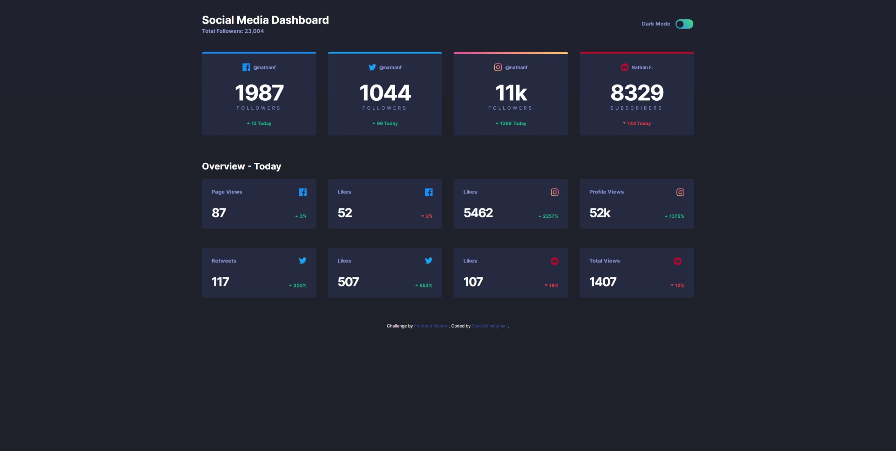
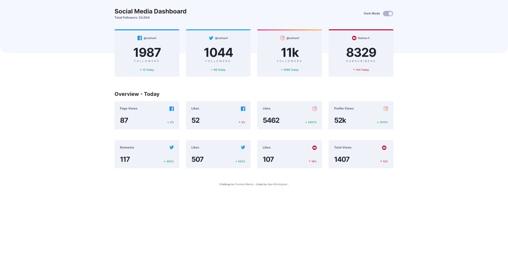

# Frontend Mentor - Social media dashboard with theme switcher solution

This is a solution to the [Social media dashboard with theme switcher challenge on Frontend Mentor](https://www.frontendmentor.io/challenges/social-media-dashboard-with-theme-switcher-6oY8ozp_H). Frontend Mentor challenges help you improve your coding skills by building realistic projects.

## Table of contents

- [Overview](#overview)
  - [The challenge](#the-challenge)
  - [Screenshot](#screenshot)
  - [Links](#links)
- [My process](#my-process)
  - [Built with](#built-with)
  - [What I learned](#what-i-learned)
  - [Useful resources](#useful-resources)
- [Author](#author)
- [Acknowledgments](#acknowledgments)

## Overview

### The challenge

Users should be able to:

- View the optimal layout for the site depending on their device's screen size
- See hover states for all interactive elements on the page
- Toggle color theme to their preference

### Screenshot




### Links

- [Solution](https://www.frontendmentor.io/solutions/social-media-dashboard-with-theme-switcher-CiGcXepVQu)
- [Preview Site](https://fem-social-media-dashboard-sb.netlify.app/)

## My process

### Built with

- Semantic HTML5 markup
- CSS custom properties
- Flexbox
- CSS Grid
- Sass/SCSS
- Gulp
- JavaScript

### What I learned

Below is a sass function which converts px to em.

```scss
@use 'sass:math';

@function rem($pixels, $context: 16) {
  @return (math.div($pixels, $context)) * 1rem;
}
```

### Useful resources

- [CSS Tricks](https://css-tricks.com/snippets/sass/px-to-em-functions/) - This helped me with creating a sass function that converts px to em for responsiveness.

## Author

- Frontend Mentor - [@sean-birmingham](https://www.frontendmentor.io/profile/sean-birmingham)
- Twitter - [@thehydra98](https://www.twitter.com/thehydra98)
- Linkedin - [sean-birmingham](https://www.linkedin.com/in/sean-birmingham/)

## Acknowledgments

I would like to acknowledge [Coder Coder](https://www.youtube.com/c/TheCoderCoder) for their [YouTube playlist](https://www.youtube.com/playlist?list=PLUWqFDiirlsu5az5EIyxe8ZddyNO_kDuP) on building this project.
